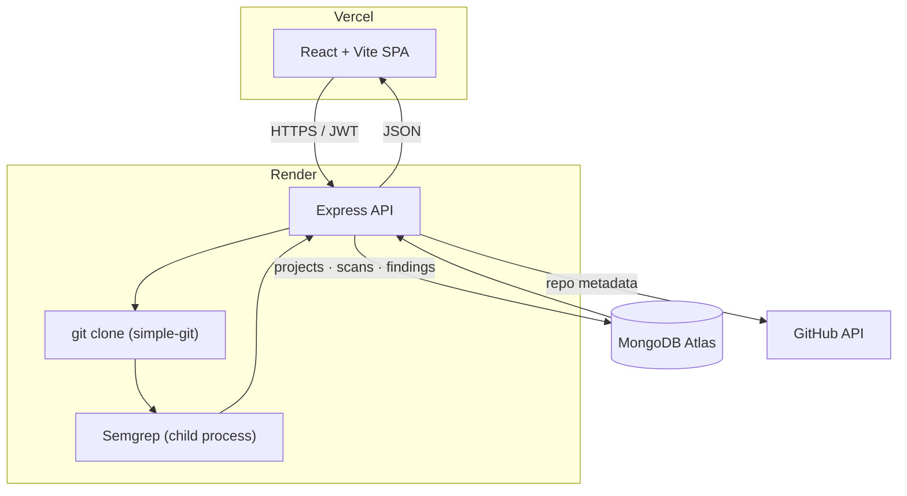
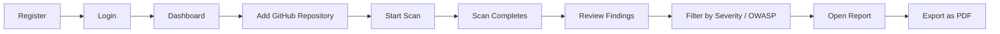
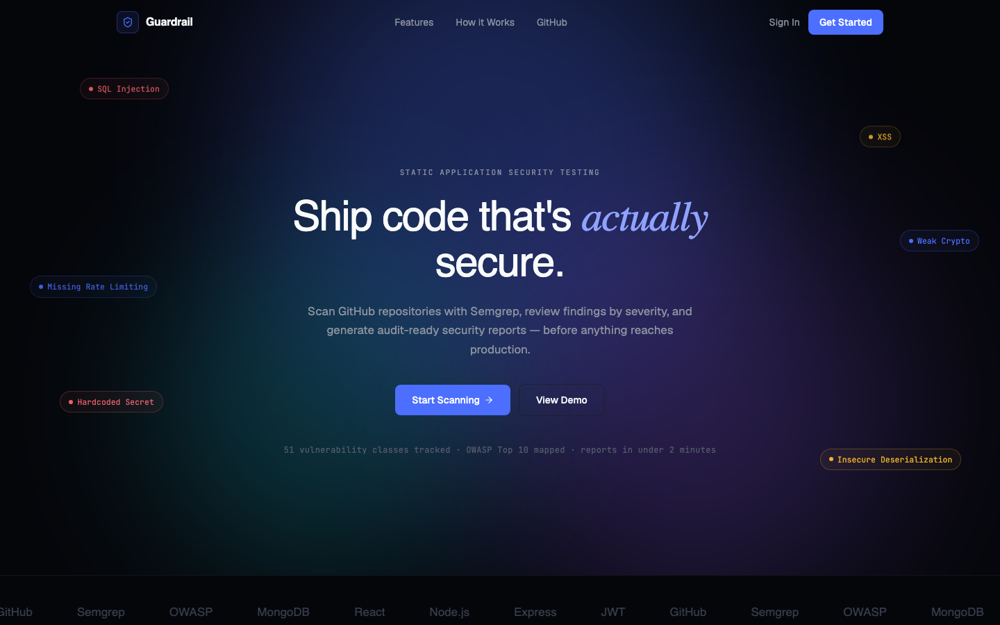
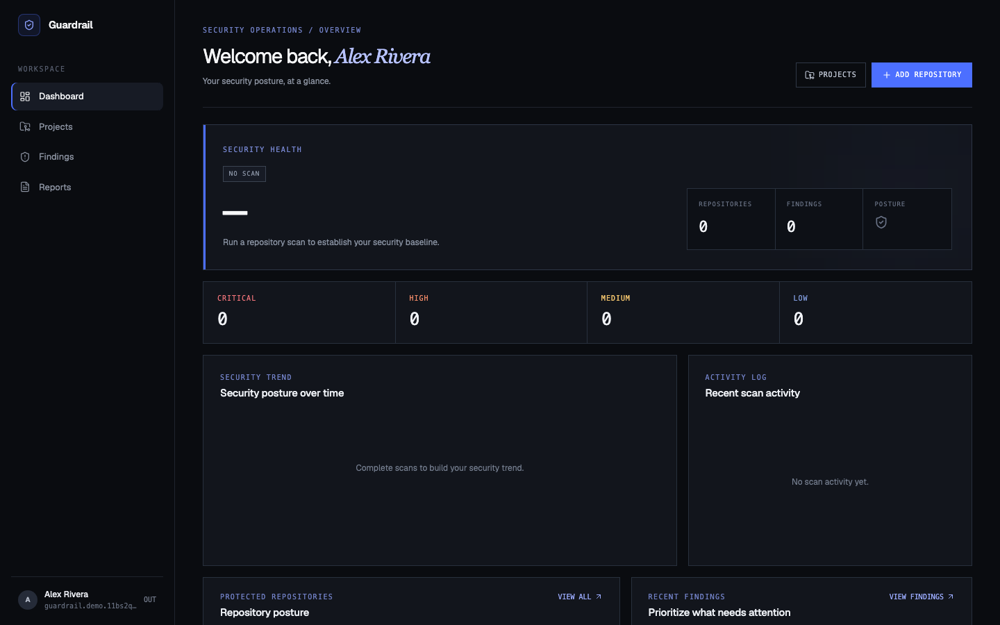
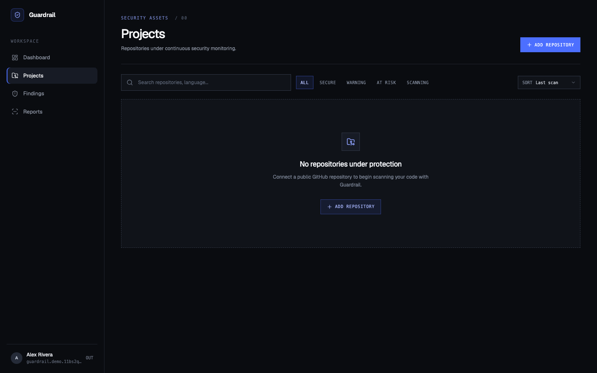
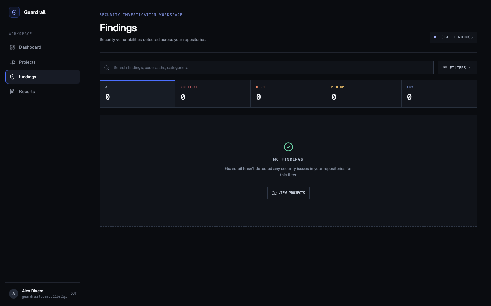
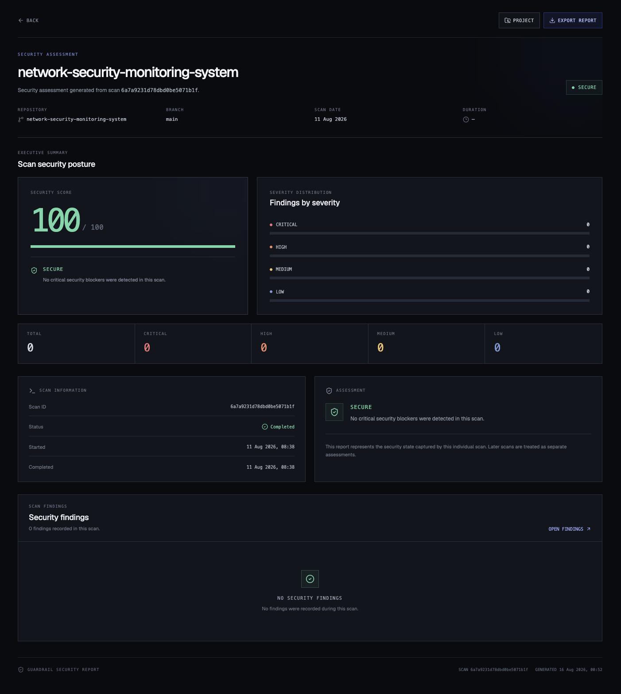

# 🛡️ Guardrail

**Static Application Security Testing for GitHub repositories.**

Guardrail clones a repository, runs [Semgrep](https://semgrep.dev/) against it, classifies what it finds by severity and OWASP category, and turns raw scanner output into a reviewable, reportable security workflow.


**[Live Demo](https://guardrail-livid.vercel.app)** · **[API](https://guardrail-efrn.onrender.com)** · **[Report an Issue](../../issues)**

---

## Table of Contents

- [Overview](#overview)
- [Problem Statement](#problem-statement)
- [Features](#features)
- [How It Works](#how-it-works)
- [Architecture](#architecture)
- [Tech Stack](#tech-stack)
- [Security Analysis](#security-analysis)
- [Application Workflow](#application-workflow)
- [Screenshots](#screenshots)
- [Getting Started](#getting-started)
- [Environment Variables](#environment-variables)
- [Running Locally](#running-locally)
- [Testing](#testing)
- [API Overview](#api-overview)
- [Project Structure](#project-structure)
- [Deployment](#deployment)
- [Limitations](#limitations)
- [Future Improvements](#future-improvements)
- [Security Considerations](#security-considerations)
- [Contributing](#contributing)
- [License](#license)
- [Author](#author)

---

## Overview

Guardrail is a security-scanning dashboard built for developers who want visibility into the security posture of their GitHub repositories without leaving a browser tab. Point it at a repo, start a scan, and Guardrail handles the rest — cloning, static analysis, classification, and presentation — so the output is a prioritized list of findings instead of a wall of scanner JSON.

It's aimed at individual developers and small teams who want lightweight, on-demand SAST coverage integrated into a single workspace, rather than a full enterprise AppSec platform.

## Problem Statement

- Code gets pushed to GitHub continuously, and security issues can slip in unnoticed.
- Manual security review doesn't scale with how fast code changes.
- Static analysis tools like Semgrep are powerful, but their raw output is a firehose of JSON — not something a developer wants to read after every scan.
- Findings need context: severity, OWASP mapping, remediation guidance, and history — not just a rule ID and a line number.

Guardrail exists to wrap the scan → findings → report loop around Semgrep, so the output is something a developer actually acts on.

## Features

**🔐 Authentication**
- Registration & login with hashed passwords
- JWT-based sessions
- Protected routes, both client- and server-side

**📦 Repository Management**
- Add a GitHub repository as a project (validated against the GitHub API)
- Track project metadata: language, default branch, last scan
- Delete projects

**🔎 Security Scanning**
- Shallow-clone a repository and run Semgrep (`--config auto`)
- Concurrency-safe scan state — a project can't be double-scanned
- Automatic workspace cleanup after each scan

**🚨 Findings**
- Severity classification (Critical / High / Medium / Low), normalized from Semgrep's own severity plus rule/CWE-based escalation
- OWASP and CWE tagging pulled from Semgrep rule metadata
- Per-rule remediation guidance, with sensible fallbacks when a rule doesn't provide one
- Global findings workspace, filterable by severity, OWASP category, project, and search term

**📊 Dashboard**
- Aggregate security score across all projects
- Severity distribution and score trend over time
- Recent activity feed and top critical findings

**📄 Reports**
- Per-scan report view
- Print-to-PDF export

## How It Works

```
GitHub Repository URL
        │
        ▼
Project Creation (GitHub API validates owner/repo)
        │
        ▼
Start Scan  ──────────► Shallow clone (simple-git)
        │
        ▼
Semgrep scan (--config auto, JSON output)
        │
        ▼
Finding extraction & normalization
  • severity normalization + critical-pattern escalation
  • OWASP / CWE tagging from rule metadata
  • remediation resolution
        │
        ▼
Persisted to MongoDB
        │
        ▼
Repository workspace cleaned up from disk
        │
        ▼
Dashboard · Findings Workspace · Scan Report (PDF export)
```

## Architecture



## Tech Stack

| Layer                   | Technology                              |
| ------------------------ | ---------------------------------------- |
| Frontend                 | React 19                                 |
| Build tool                | Vite                                     |
| Styling                   | Tailwind CSS v4                          |
| Routing                   | React Router                             |
| HTTP client                | Axios                                    |
| Backend                   | Node.js + Express 5                      |
| Database                  | MongoDB Atlas (Mongoose)                 |
| Authentication             | JWT                                      |
| Password hashing            | bcryptjs                                 |
| Validation                 | Zod                                      |
| Security headers            | Helmet                                   |
| Rate limiting               | express-rate-limit                       |
| Security scanner             | Semgrep                                  |
| Repository integration        | GitHub API, simple-git                   |
| Testing                    | Vitest + Supertest                       |
| Frontend hosting             | Vercel                                   |
| Backend hosting              | Render                                   |

## Security Analysis

Guardrail is a security tool, so its own scanning pipeline is worth explaining in more detail than a feature list:

- **Scanning.** Repositories are shallow-cloned (`--depth 1`, with a hard timeout) and scanned with `semgrep scan --config auto --json`, invoked via `execFile` with an argument array — never shell string interpolation — so a malicious repository name or path can't reach a shell.
- **Input validation.** Repository URLs are checked against a GitHub owner/repo pattern before use, and the *confirmed* values returned by the GitHub API — not the raw client-submitted string — are what get persisted and cloned.
- **Severity classification.** Semgrep's own severity (`ERROR` / `WARNING` / `INFO`) is normalized to `High` / `Medium` / `Low`, then escalated to `Critical` when a finding matches known-critical rule-ID patterns (SQL injection, command injection, RCE, hardcoded secrets, JWT `none`-algorithm, insecure deserialization) or a critical CWE (CWE-77, 78, 89, 94, 502, 798).
- **OWASP / CWE mapping.** Pulled directly from each Semgrep rule's own metadata — Guardrail doesn't invent classifications, it surfaces what the rule already asserts.
- **Remediation.** Each finding resolves a recommendation from the rule's own metadata first, falling back to a small set of pattern-based recommendations (e.g. TLS verification, hardcoded credentials) when a rule doesn't ship one.
- **Concurrency safety.** Scan start is an atomic `findOneAndUpdate` claim on the project's status — two overlapping "start scan" requests can't both proceed.
- **Cleanup.** The cloned repository is deleted from disk after every scan, pass or fail.
- **Authentication & authorization.** JWTs are verified on every protected route; every project/scan/finding query is scoped to `owner: userId`, so one user can never read or act on another user's data.
- **Rate limiting.** Auth endpoints and scan-start are rate-limited separately from general API traffic, to blunt credential-stuffing and scan-spam.
- **Transport & headers.** Helmet sets standard security headers; CORS is locked to an explicit origin allowlist, not wildcarded.
- **Secrets.** Nothing is committed to the repo — `JWT_SECRET`, `MONGODB_URI`, and `GITHUB_TOKEN` are environment-only, with `.env.example` documenting the shape, not the values.

## Application Workflow



## Screenshots


| Landing | Dashboard |
| --- | --- |
|  |  |

| Projects | Findings |
| --- | --- |
|  |  |

| Scan Report |
| --- |
|  |

## Getting Started

### Prerequisites

- Node.js 20+
- [Semgrep](https://semgrep.dev/docs/getting-started/) installed and on your `PATH` (or point `SEMGREP_BIN` at a binary)
- A MongoDB connection string (e.g. MongoDB Atlas)
- A GitHub personal access token (for repository metadata lookups)
- Git

```bash
git clone https://github.com/Sunkencoder19/guardrail.git
cd guardrail
```

## Environment Variables

Values are never committed — only `.env.example` files are tracked. Copy each and fill in real values locally.

### Server (`server/.env`)

| Variable       | Description                                                        |
| -------------- | -------------------------------------------------------------------- |
| `PORT`         | Port the API listens on (e.g. `8000`)                                |
| `MONGODB_URI`  | MongoDB connection string                                             |
| `JWT_SECRET`   | Secret used to sign auth tokens                                       |
| `GITHUB_TOKEN` | GitHub PAT used for repository lookups                                |
| `CLIENT_URL`   | Comma-separated allowed CORS origin(s), e.g. `http://localhost:5173`  |
| `NODE_ENV`     | `development` / `production` / `test`                                 |
| `SEMGREP_BIN`  | Optional override path to the Semgrep binary                          |

### Client (`client/.env`)

| Variable       | Description                                    |
| -------------- | ------------------------------------------------ |
| `VITE_API_URL` | Base URL of the Guardrail API, including `/api`  |

## Running Locally

**Backend**

```bash
cd server
npm install
cp .env.example .env   # fill in the values above
npm run dev
```

**Frontend**

```bash
cd client
npm install
cp .env.example .env   # fill in the value above
npm run dev
```

The frontend runs at `http://localhost:5173`, and expects the API at `http://localhost:8000/api` by default (override via `VITE_API_URL`).

## Testing

```bash
cd server
npm test
```

Runs the Vitest + Supertest suite — auth flows and the scan-concurrency guard — against a dedicated `<db>-test` database derived from `MONGODB_URI`, so it never touches real data.

## API Overview

All routes below except register/login require a `Bearer` JWT.

**Authentication**
```
POST /api/users/register
POST /api/users/login
GET  /api/users/me
```

**Projects**
```
GET    /api/projects
POST   /api/projects
GET    /api/projects/:id
PUT    /api/projects/:id
DELETE /api/projects/:id
```

**Scans**
```
POST /api/scans/:projectId
GET  /api/scans
GET  /api/scans/project/:projectId
GET  /api/scans/:scanId
```

**Findings**
```
GET  /api/findings
POST /api/findings/:scanId
GET  /api/findings/scan/:scanId
GET  /api/findings/:findingId
```

**Reports & Dashboard**
```
GET /api/reports/:scanId
GET /api/dashboard
```

## Project Structure

```
guardrail/
├── client/
│   ├── public/
│   └── src/
│       ├── api/          # Axios instance + interceptors
│       ├── components/   # UI components (shadcn-based)
│       ├── context/       # AuthContext
│       ├── lib/
│       ├── pages/          # Landing, Login, Register, Dashboard,
│       │                   # Projects, Findings, Report, NotFound
│       ├── routes/         # ProtectedRoute
│       ├── App.jsx
│       └── main.jsx
│
├── server/
│   └── src/
│       ├── config/         # db.js
│       ├── controllers/
│       ├── middleware/     # auth, rate limiting, validation, errors
│       ├── models/         # User, Project, Scan, Finding
│       ├── routes/
│       ├── services/       # github, clone, semgrep, scan, finding,
│       │                   # dashboard, report, cleanup
│       ├── validators/     # Zod schemas
│       ├── utils/          # ApiError
│       ├── test/           # Vitest + Supertest suite
│       └── app.js
│
└── README.md
```

## Deployment

| Layer     | Platform | Notes |
| --------- | -------- | ----- |
| Frontend  | [Vercel](https://guardrail-livid.vercel.app) | SPA rewrite in `client/vercel.json` routes all paths to `index.html` |
| Backend   | [Render](https://guardrail-efrn.onrender.com) | Runs behind Render's reverse proxy — `app.set("trust proxy", 1)` is required for `express-rate-limit` to read the real client IP from `X-Forwarded-For` |
| Database  | MongoDB Atlas | Connection string via `MONGODB_URI` |
| Scanner   | Semgrep | Installed on the Render instance; path configurable via `SEMGREP_BIN` for portability across environments |

## Limitations

- Guardrail is a SAST tool — it finds patterns Semgrep's rules know about, not every vulnerability class. It's one layer of a security program, not a full assessment.
- Detection quality is bounded by Semgrep's `auto` ruleset for the target language; unsupported languages/frameworks will have shallower coverage.
- Large repositories take longer to clone and scan, and are subject to the configured timeouts.
- Running on Render's free tier means cold starts and limited concurrent scan throughput.

## Future Improvements

- Additional scanners beyond Semgrep, for broader coverage
- CI/CD integration (scan on push / PR)
- Scheduled, recurring scans
- Pull-request-level security checks
- Team / workspace support for shared projects
- In-app notifications for new critical findings

## Security Considerations

- Never commit `.env` files — only `.env.example` is tracked, and secrets are provisioned per-environment.
- Rotate `JWT_SECRET` and `GITHUB_TOKEN` if they're ever exposed.
- MongoDB credentials are environment-only and scoped to the Atlas project.
- CORS is restricted to an explicit origin allowlist (`CLIENT_URL`), not wildcarded.
- Auth and scan-start endpoints are rate-limited independently of general API traffic.
- All inputs are validated server-side with Zod before touching the database or filesystem.
- Cloned repositories are removed from disk immediately after each scan.

## Contributing

1. Fork the repository
2. Create a feature branch
3. Make your changes
4. Run the test suite (`npm test` in `server/`)
5. Open a pull request

## License

No license has been added yet — all rights reserved by default until one is chosen.

## Author

**Fattesing Rane**
Computer Engineering · Cybersecurity
